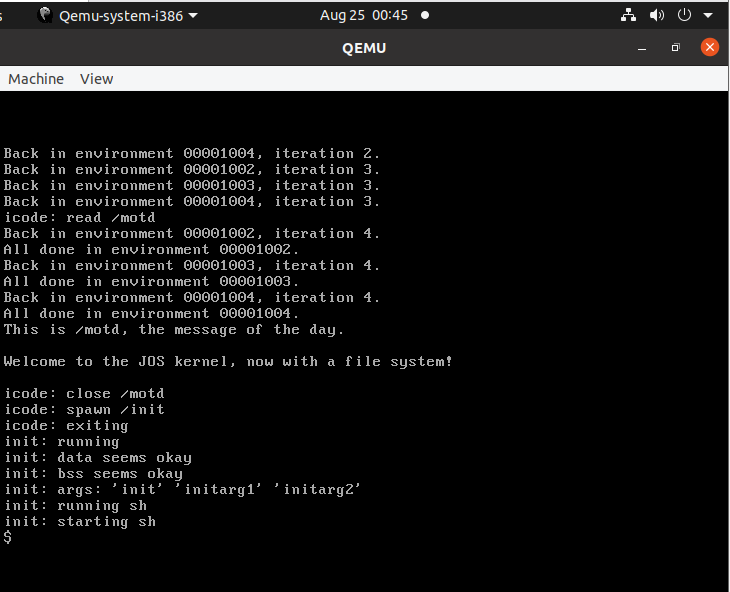
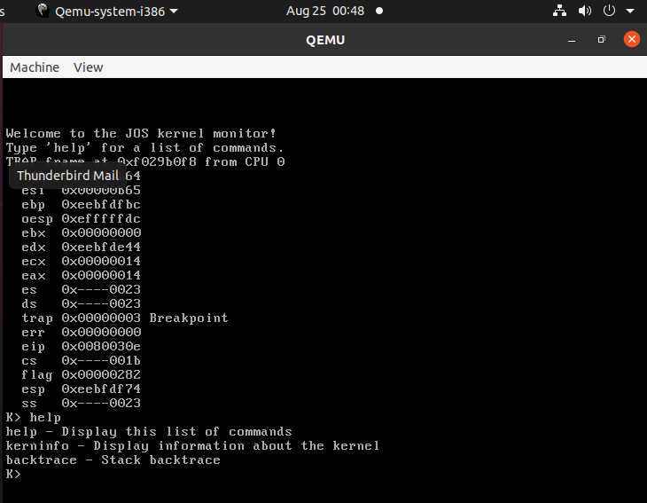

# MIT-6.828-JOS

- Lab Name：MIT 6.828 2018
- lab link：https://pdos.csail.mit.edu/6.828/2018/schedule.html

- Platform:  Workstation 16 Pro + Ubuntu 20.04.2 LTS

- 介绍：认真完成了lab1-lab5的实验部分，由于该实验是面向研究生的，所以难度有点大，查阅的资料也较多。每个实验写了详细的实验文档，总计约16万5千字。


## DONE

| [MIT 6.828 2018](https://pdos.csail.mit.edu/6.828/2018/schedule.html) | DONE | WORD  |
| ------------------------------------------------------------ | ---- | ----- |
| [Tools](https://pdos.csail.mit.edu/6.828/2018/tools.html)    | ✅    | 3024  |
| [Lab guide](https://pdos.csail.mit.edu/6.828/2018/labguide.html) | ✅    | 3994  |
| [Lab 1: Booting a PC](https://pdos.csail.mit.edu/6.828/2018/labs/lab1/) | ✅    | 38254 |
| [Lab 2: Memory Management](https://pdos.csail.mit.edu/6.828/2018/labs/lab2/) | ✅    | 22087 |
| [Lab 3: User Environments](https://pdos.csail.mit.edu/6.828/2018/labs/lab3/) | ✅    | 32449 |
| [Lab 4: Preemptive Multitasking](https://pdos.csail.mit.edu/6.828/2018/labs/lab4/) | ✅    | 38026 |
| [Lab 5: File system, Spawn and Shell](https://pdos.csail.mit.edu/6.828/2018/labs/lab5/) | ✅    | 18505 |
| [Lab 6: Network Driver](https://pdos.csail.mit.edu/6.828/2018/labs/lab6/) |      |       |
| Summary                                                      | ✅    | 10017 |


## Function

| **Function**                            | **Done** |
| --------------------------------------- | -------- |
| **Booting a PC**                        | ✅        |
| power-on bootstrap procedure            | ✅        |
| boot loader                             | ✅        |
| initialize kernel                       | ✅        |
| **Memory Management**                   | ✅        |
| physical page allocator                 | ✅        |
| Virtual Memory -- Page Table Management | ✅        |
| **User Environments**                   | ✅        |
| Process management                      | ✅        |
| Handling Interrupts and Exceptions      | ✅        |
| Handling Page Faults                    | ✅        |
| Breakpoint Exception                    | ✅        |
| System calls                            | ✅        |
| User-mode startup                       | ✅        |
| **Preemptive Multitasking**             | ✅        |
| Multiprocessor Support                  | ✅        |
| big kernel lock                         | ✅        |
| Round-Robin Scheduling                  | ✅        |
| System Calls for Environment Creation   | ✅        |
| User-level page fault handling          | ✅        |
| Copy-on-Write Fork                      | ✅        |
| Clock Interrupts and Preemption         | ✅        |
| Inter-Process communication (IPC)       | ✅        |
| **File system, Spawn and Shell**        | ✅        |
| File system                             | ✅        |
| The file system interface               | ✅        |
| Spawning Processes                      | ✅        |
| Shell                                   | ✅        |
| **Network Driver**                      |          |
| The Network Server                      |          |
| The Network Interface Card              |          |
| Transmitting Packets                    |          |
| The Web Server                          |          |


## Getting Started

**Prerequisites** : Workstation 16 Pro + Ubuntu 20.04.2 LTS

### Tools

- X86 emulator --  **QEMU**  ===>  run  kernel
- compiler toolchain ----- assembler --> linker ---> C compiler --> debugger ==> compile and test kernel
- Debathena Machine  |  virtual machine(√)
- envs: Linux(recommand)   | windows(Cygmin)


#### compiler toolchain 

- gcc

```shell
$ sudo apt install gcc 

$  gcc -v

$ gcc -m32 -print-libgcc-file-name
/usr/lib/gcc/x86_64-linux-gnu/9/32/libgcc.a  # 32位
```


- QEMU Emulator

```shell
# clone
$ git clone https://github.com/mit-pdos/6.828-qemu.git qemu

# dependent libraries
$ sudo apt install libsdl1.2-dev
$ sudo apt install libtool-bin
$ sudo apt install libglib2.0-dev
$ sudo apt install libz-dev
$ sudo apt install libpixman-1-dev

# compiler
$ cd qemu
$ make

# error
/home/***/qemu/qga/commands-posix.c:633: undefined reference to `major'
/usr/bin/ld: /home/llf/qemu/qga/commands-posix.c:634: undefined reference to `minor'
collect2: error: ld returned 1 exit status
make: *** [Makefile:288: qemu-ga] Error 1

$ vim qga/commands-posix.c
# add head file
#include <sys/sysmacros.h>

# install
# 安装
$ make install
```


### Runing

```shell
# clone
$ git clone https://github.com/lif314/MIT-6.828-JOS.git

$ cd lab

# runnig
$ make qemu
```


### shell



**command:**

```shell
$ ls
$ lsfd
$ sh <testshell.sh
$ cat
$ echo ""
$ testshell # breakpoint -----> enter kernel
```


### kernel



**command:**

```shell
K> help
K> kerninfo
K> backtrace
```
